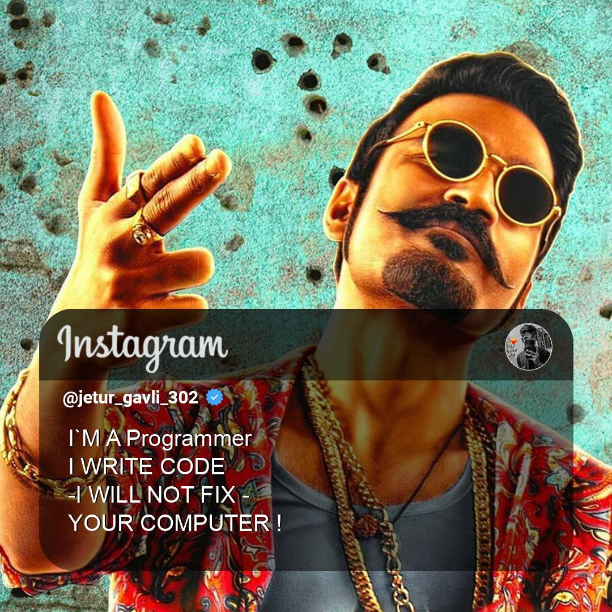
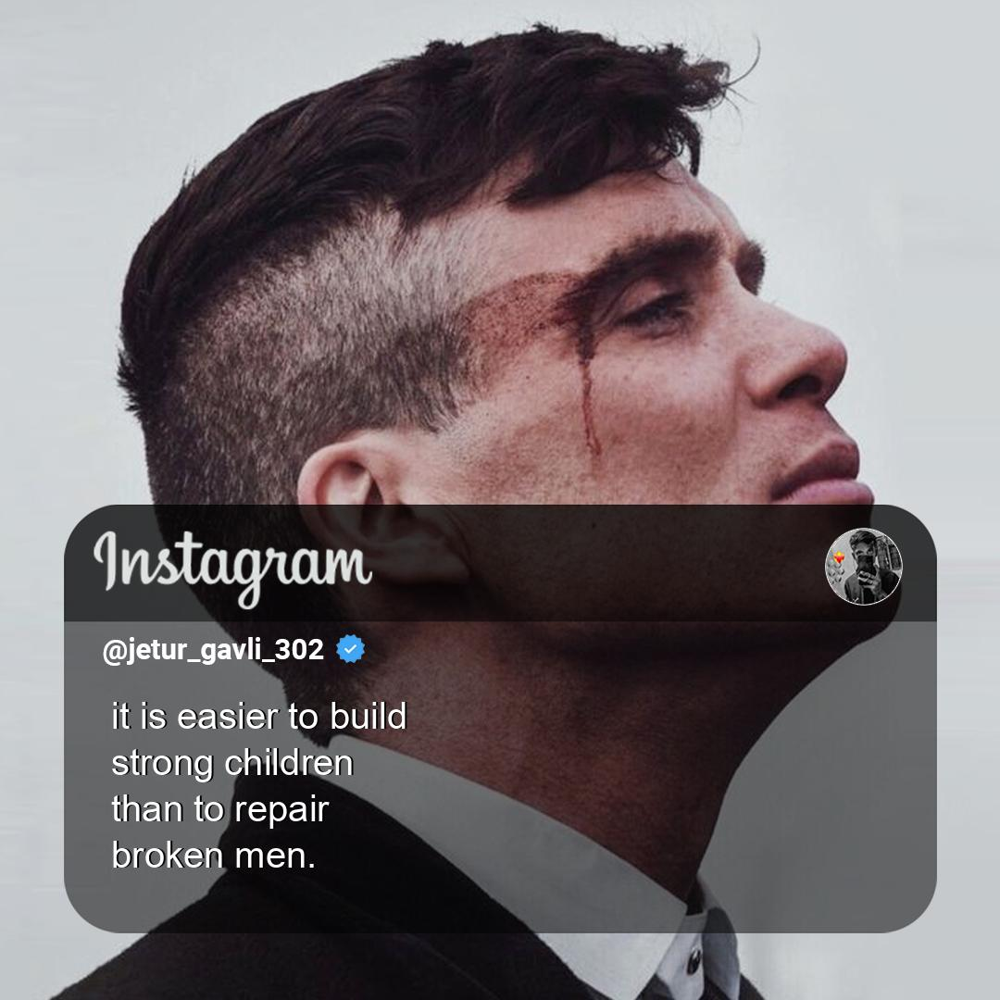

# ✨ Quote Image Generator for Instagram 
[](Licence)

## 📷🖼 Spice Up Your Insta-Pics with Quotes and Pixels! 
Ever dreamed of making your Instagram feed pop like a Bollywood blockbuster? 🎬 Look no further than this Python script! Whip up custom images faster than debugging code (well, almost), with backgrounds as vibrant as your meme collection. Whether you're slinging code or slinging jokes, this tool lets you blend quotes with pictures like chai blends with pakoras (a match made in desi heaven 🍵🥟).

So, what's the punchline? Pick your favorite font and unleash your creativity on Insta. Because who says programmers can't be meme lords too? 💬😎

## (¬_¬")

**_This Python script allows you to create images with custom quotes. It lets you choose a background image, specify the text to be displayed, and select the text color. The resulting image can be saved with a specified filename._**

## 📝 Requirements 

- Python 3.x
- Pillow library (`PIL`)
- `colorama` library

## 🦴 Directory Structure 

- `Backgrounds/` should contain the background images you want to choose from.
- `Fonts/` should contain the font files (e.g., `arial.ttf`).
- `Program Stuff/` should contain any additional images required for compositing (e.g., Img-2.png).
- `Quotes_Output/` is where the generated images will be saved.

## 💖 Instagram Quote Image Generator (Output) 
<div style="display: flex;">
    
    
</div>


## 😅 Usage 
1. **Install Requirments**
    ```bash
    pip install -r requirements.txt`
    ```
2. **Run the script:**
    ```bash
    python IG-Quotes-Generator.py
    ```
3. **Follow the prompts:**
    - **Choose Background:** Enter the name of the background image file (without the extension) located in the `Backgrounds/` directory.
    - **Enter text for each line:** Provide the text for each line (up to 5 lines).
    - **Enter text color:** Specify the text color (either `white` or `black`).
    - **Enter image name:** Provide a name for the output image file (the script will save it as a `.jpg` file in the `Quotes_Output/` directory).

## ⭐ Star 
**_If you find this Instagram Quote Image Generator script helpful and fun to use, please consider showing your support by starring the project on GitHub! 🌟 Your stars encourage me to keep improving this tool and adding more exciting features._**

## 🗿 Author 
[Jetur Gavli](https://github.com/jeturgavli)

## ⚖️ Licence 
[MIT](Licence)

<div style="background-color: #def0da; color: #64946D; padding: 16px 24px;">
 <div style="font-size: 16px; font-weight: bold;">✔ Notes</div>
 <div style="font-size: 16px">
 If you would like to add a <b>new feature</b>, feel free to send me a pull request or discuss it with me first. <b>Thank you! ❤</b>
 </div>
</div>


